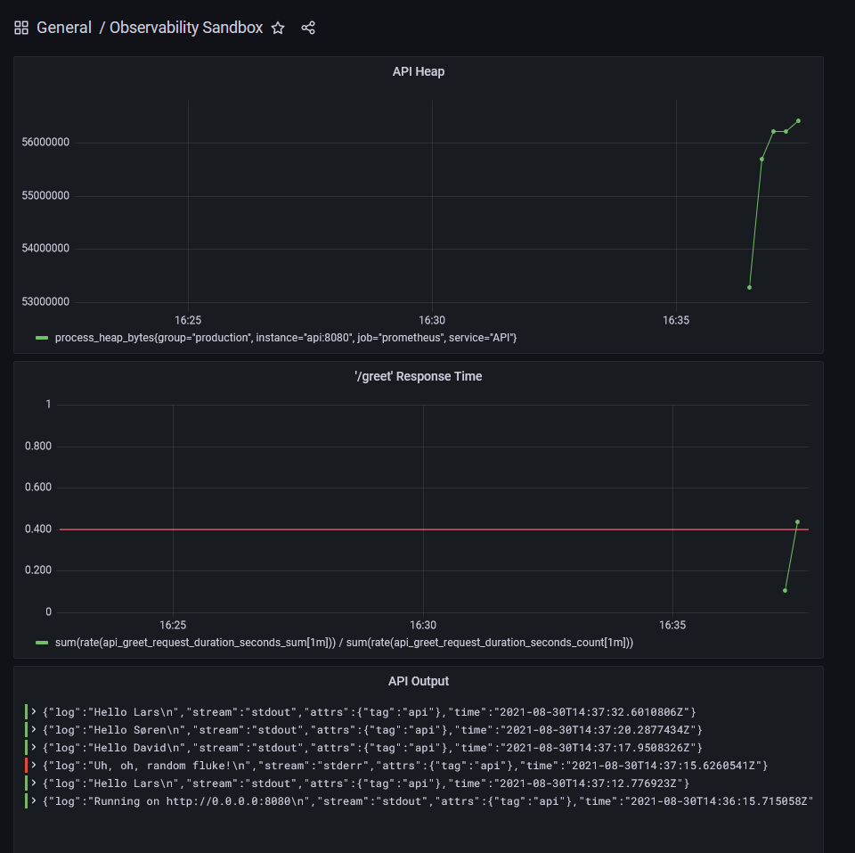

# observability-sandbox

Open Source monitoring, logging and tracing with Prometheus, Loki and Grafana for:

- Host (CPU, memory, storage)
- Database
- Web API
- Front-end

## Prerequisites

- Docker
- Bash

## Prerequisites (Windows)

In Windows Command Prompt:

```
net use h: \\wsl$\docker-desktop-data
```

For the remaining steps use Docker Desktop with WSL2 back-end, and run from Git Bash

```
sudo mkdir /mnt/docker
sudo mount -t drvfs h: /mnt/docker
```

## Start all services

```
docker-compose up --build
```

## Use services

- Front-end (our code): http://localhost:8081/
- API (our code): http://localhost:8080/greet?name=Lars
- Grafana (visualization): http://localhost:3000 (auth: lars/lars)
- Prometheus (metric store): http://localhost:9090/graph
- Loki (log store): http://localhost:3100/ready
- Promtail (log collector): http://localhost:9080/

## Start services individually

Instead of using docker-compose, each service can be started individually:

```
(cd loki && ./restart.sh)
(cd promtail && ./restart.sh)
(cd nodejs && ./restart.sh)
(cd prometheus && ./restart.sh)
(cd grafana && ./restart.sh)
(cd cdn && ./restart.sh)
```

## Sample display

http://localhost:3000/d/obs/observability-sandbox


